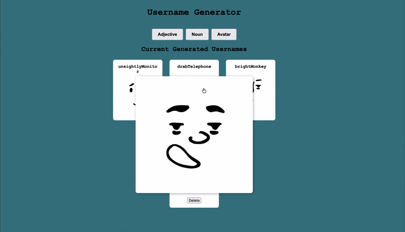

# user-name-generator

## Description

JavaScript project for PCA. This web app allows you to generate random usernames and avatars.

## Built With

- [DiceBear API](https://www.dicebear.com/how-to-use/http-api/)
- [random-word-slugs](https://www.npmjs.com/package/random-word-slugs)
- JSON Server

## Demo



## Features

- Generate random adjective and nouns for a combined username
- Generate a avatar to go alone with your username
- Save usernames you enjoy the most
- Delete usernames you no longer find appealing

## Setup

### 1. Clone the repo via SSH

```bash
git clone git@github.com:BarkleyRhoat/user-name-generator.git
cd user-name-generator 
```

### 2. Open in text editor

```bash
code . 
```

### 3. Install dependencies

```bash
npm install
```

### 4. Install JSON Server

```bash
npm install -g json-server
```

### 5. Start JSON Server

In one terminal start the API server:

```bash
json-server --watch db.json
```

### 6. Start live-server

In second terminal, open the app using the VS Code Live Server extension or run

```bash
npx serve
```

> **Note:** The `.vscode/settings.json` is configured to ignore `db.json` so Live Server won't reload the page when data is saved.
